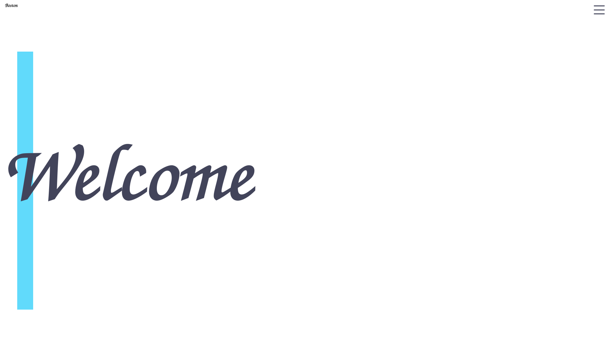

# Personal Portfolio Site

[](https://bostonrohan.com/)

## Table of Contents

- [General Info](#general-info)
- [Technologies](#technologies)
- [Setup](#setup)

## General Info

Personal Portfolio site contianing information about me, my accomplishments in school, becoming a self-taught developer, my resume, blog, and other aspects of my life.

## Technologies

- framer-motion version: 4.1.17
- react version: 17.0.2
- react-intersection-observer version: 8.33.0
- react-router-dom version: 5.3.0
- react-scroll version: 1.8.4
- bootstrap-icons version: 1.6.1
- emailjs-com: version: 3.2.0
- react-gist version: 1.2.4

## Hosting Platform

- [Netlify](https://www.netlify.com/)

## Setup

To run this project locally, install it via npm:

```
$ cd ../Personal-Website
$ npm install
$ npm start
```
